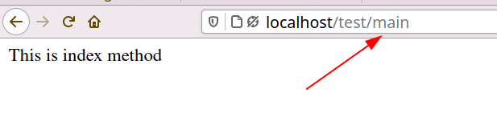

# Controllers in Lowcode

Controllers are used perform some operation before loading views in web.

you are already familier about Routes for Controller in lowcode if not then click [here](Routing.md).

**LowCode** automatically create resource routes for your controller.

As a reference Route path of Controller Methods are:-

| Verb |  Path | Route Name | Controller File @ Function |
|------|-------|------------|-----------------|
| GET  | /**modulename**/**controllername** | **modulename**.index | custom/ext/packages/**modulename**/Controller/**controllername**.php @ index |
| GET  | /**modulename**/**controllername**/{key} | **modulename**.show | custom/ext/packages/**modulename**/Controller/**controllername**.php @ show |
| GET  | /**modulename**/**controllername**/create | **modulename**.create | custom/ext/packages/**modulename**/Controller/**controllername**.php @ create |
| POST | /**modulename**/**controllername** | **modulename**.store | custom/ext/packages/**modulename**/Controller/**controllername**.php @ store |
| GET  | /**modulename**/**controllername**/{key}/edit | **modulename**.edit | custom/ext/packages/**modulename**/Controller/**controllername**.php @ edit |
| POST (@method('put')) | /**modulename**/**controllername**/{key} | **modulename**.update | custom/ext/packages/**modulename**/Controller/**controllername**.php @ update |
| POST (@method('delete'))| /**modulename**/**controllername**/{key} | **modulename**.destroy | custom/ext/packages/**modulename**/Controller/**controllername**.php @ destroy |


# Table of content

- [Creating Controllers](#creating_controllers_in_lowcode)
- [Setting Up Directory](#setting_up_directory_for_controllers)
- [Creating Controller File](#creating_controller_file)
- [Controller File sample](#controller_file_sample)
- [Examples](#example_for_accessing_routes)


# Creating Controllers in Lowcode

You can create any number of controller associated with a module. 

To create a **Controller** you need to create **Sub Module** for a **Module** . The name you choose to create **Sub Module** will be your controller name. After creating Sub Modules you need to create a directory in **packages** same name as **Module Name** then add another directory named **Controller** and then in Controller directory you have a create a Controller file named same as **Sub Module** name .

For eg:- If Sub Module name is **Post** then in **Controller** directory your file will be **Post.php** .

Let's understand Step by Step:- 

### Steps to create Controller

- Open **Designer** window
- Open **Module** menu from **Designer**
- Select your module or create a new module
- Now look for **Sub Module** section in **Module** menu
- In Sub Module section create a Sub Module you can create any number of sub modules These Sub modules are equivalent to Controllers.
	- In Sub Module Section There are Three Fields **SubModule Name**, **SubModule Route** and **SubModule Icon**[Optional] .
	- **SubModule Name** - Here you have to provide the name of controller that you want to create.
	- **SubModule Route** - Here you have to provide Route i.e. By which URL you want to access it you can provide any name there is no boundation.
		- For eg:- If I have submodule name is **Post** then i can give route as **Post** simply **Post/test** but you can choose any name.
- After creating **Sub Module** click **Save Button**.

**Demo Ex:-**

 

Here in this Ex. I have created a **Main** Sub-Module in **Test** Module. 

- Now your **Controller** is created but you have to add this **Sub Module** in role where your **Module** is added so that User with that role can access the Controller. If you don't do this you will get error **403 Unauthorized** .
	- Learn about Roles [here]().


Now you are all set to add Functionality in Controller File.

### Setting up Directory for Controllers

Once you are done with creating sub module we have to create a  directory named same as **Module Name**  in **Packages** Folder of **Custom Menu** from **Designer Window**.


Now we have to a one more Directory named **Controller** in **Module Directory** then we will add our **Main.php** Controller File in it. This Controller Directory will contain All the Controllers files related to a particular **Module** .


Now we have setup Directory where we have to keep our Contoller File.

### Creating Controller File

We have to create Controller File named same as the **Sub Module Name**. For eg: - If **Main** is the name of Sub Module then we have to create **Main.php** file in our Controller Directories.

**Ex:-**


### Controller File Sample

As you know **LowCode** follows Resource Route so basic Codes that Controller file have will be :-

```
<?php

namespace App\Custom\ModuleName\Controller;

class ControllerName
{
    public function __construct(){

    }


    public function index()
    {
        return view('custom.modulename.index');
    }


    public function show($id)
    {
        return view('custom.modulename.show',['id'=>$id]);
    }


    public function create()
    {
        return view('custom.modulename.create');
    }


    public function store()
    {
        return view('custom.modulename.store',['id'=>$id]);
    }


    public function edit($id)
    {
        return view('custom.modulename.edit',['id'=>$id]);
    }


    public function update($id)
    {
        return view('custom.modulename.update',['id'=>$id]);
    }


    public function destroy($id)
    {
        return view('custom.modulename.destroy',['id'=>$id]);
    }
}


```

### Example for Accessing Routes

- **Index Method**  - URL :: **"localhost/modulename/submoduleroute"**



- **Show Method** - URL :: **"localhost/modulename/submoduleroute/{key}"**


- **Create Method** - URL :: **"localhost/modulename/submoduleroute/create"**


- **Store Method** -  URL :: **"localhost/modulename/submoduleroute"**

	- **Store Method** triggers when you send a Post request using Form so When creating Form Add above url in Form Action  and write **POST** in Method<br>


- **Edit Method** -  URL :: **"localhost/modulename/submoduleroute/{key}/edit"**


- **Update Method** - URL :: **"localhost/modulename/submoduleroute/{key}"**

	- **Update Method** triggers when you send a Put request using Form so When creating Form Add above url in Form Action.<br>
	- Use **@method(put)** in between Form tag for making **Put** request.

- **Destroy Method** - URL :: **"localhost/modulename/submoduleroute/{key}"**

	- **Destroy Method** triggers when you send a Delete request using Form so When creating Form Add above url in Form Action.<br>
	Use @method(delete) in between Form tag.


		
