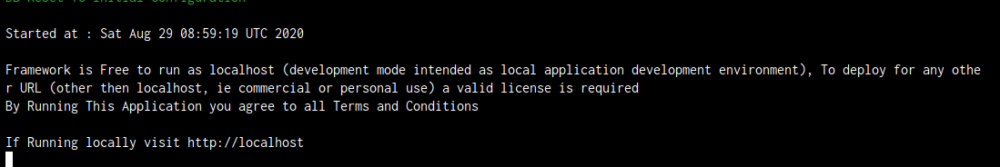
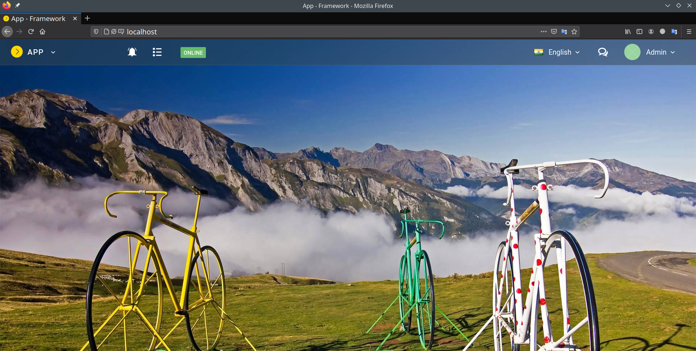

# Installation 

LowCode Framework is provided as a self-contained [Docker](https://www.docker.com/) image.So, before using LowCode, make sure you have Docker installed on your machine.

If you don't have docker so installed it by running below command
- For Ubuntu **sudo apt-get install docker-ce**
- For Arch **sudo pacman -S docker**
- For more Platform visit Docker Installation Guide - [click here](https://docs.docker.com/get-docker/)

**Important note** - For using Docker,Lowcode you need to switch your terminal to root (command for root - sudo su) 

Once you have Docker installed then change your terminal to root and Pull Lowcode Framework Image by running below commands
	
	sudo su
	docker pull kstych/framework

Once the Image Pull process is complete then clone this https://github.com/kstych/framework repo at your Desktop or anywhere you want and then run the script named **kstych.sh** provided in that repo. This hassle-free Script will setup all the things for you.

Steps to setup:- 
---	

- **Cloning Repo :-**

		git clone https://github.com/kstytch 

- **Running Script :-**
	
		Before Running Script make sure your apache server or httpd service is stopped then run script
		sh kstych.sh

- **After Running the Script you will see output like this :-**

- **Now **open browser** and type **localhost** in search bar then Framework is all set to use.**

	 	Default login : admin / yb9738z

- **To *Stop* Lowcode simply close the script from terminal.** 

	

