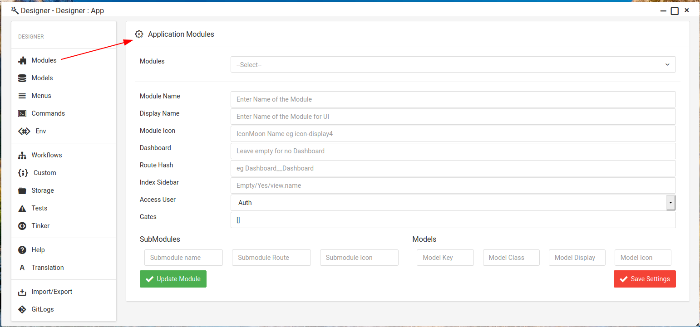
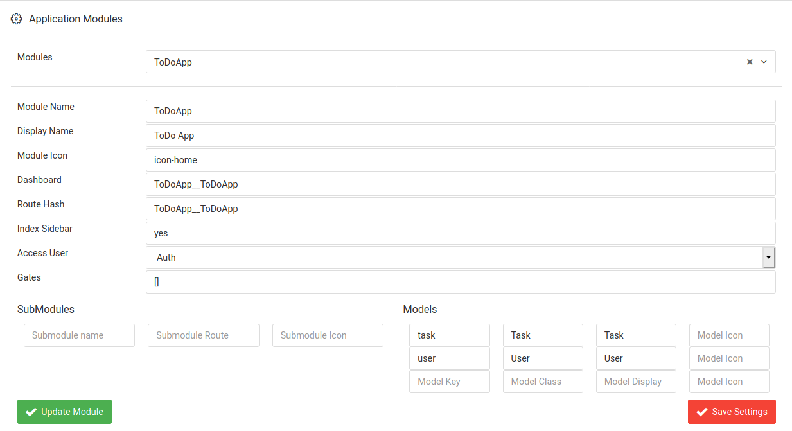
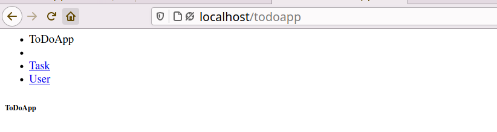

# Modules in Lowcode Framework

To create an application in **LowCode** you must create a **Module** . You can create your application by dividing its functionality in different small modules or you can create a single module for whole application.

## How to create Module ?

To create a Module open **Designer Tab** and select **Module** from sidebar. You will see the output something like below 

#### Let's Understand all Options in Module Menu.

- **Modules**
	
	Modules is dropdown menu which gives you all availabel Modules that you have created. From here you can select your module and edit it.

- **Module Name**
	
	- Module Name is the name of your Module or Application.
	- The name you provide here will be used for routes.
	- It should not contain any space.

- **Display Name**
	
	- Display Name is Name of your Module which is used for Framework UI It has no effect on your application it is just a name that is used by Framework to show window name.
	- Display Name can contain spaces.

- **Module Icon**
	 
	 - Module Icon is also a part of Framework UI to display better appearance	of windows. You can Leave it blank if you don't want to use Icon.

- **Dashboard**

	- Dashboard is one of the feature of LowCode which allows you to create a Dashboard for your application for managing the application very easily. When you create Dashboard for Module then you can access it from Header Drop Down Menu. 
	- Name of Dashboard will be ModuleName__ModuleName for better navigation. 
	- **Lowcode Dashboard** helps you to manage Models,Views and other stuff regarding that particular module very easily Learn more about Dashboard [here](Dashboard.md).

- **Route Hash**
	
	**Route Hash** is used in managing internal UI that is provided by framework. 

- **Index Sidebar**
	
	**Index Sidebar** it is also a part of internal UI that let you create a sidebar of your models.

- **Access User**

	- In this option you can choose how you want to access your Application like if you want an authenticated application where user must be logged in to access application you can go with **Auth()** option otherwise you can choose **guest** from options for no authentication where any body can access the application with url.
	- LowCode allows you to manage **Auth()** system very easily with supportive GUI so that you can create your application fastly with less coding. Learn about Lowcode Auth() System [here]().

- **Gates** 	
	
	- **Gates** are one of the special & unique feature in **Lowcode** .

- **Models**

	- Models are basic concepts of MVC. Which is used for managing Database Tables.
	- **LowCode** allows you to create Models very easily by just writing the name of model and rest of the things will be automatically done for you like Migration you don't need to worry about.
	- Learn About **Lowcode Model** in  detail [here]().

So Now, we have basic understanding of available options in Module menu so Let's create a Module.

## Creating Module

Suppose the name of our application is **TodoApp**  and we want to add **Task** and **User** Model in it and also let's add **Auth** functionality so that only Authenicated User can Access ToDoApp.

**Sample Output to create above mentioned Module will be**

So when you click the **Save Settings** button your module will be created now to you add this module in your existing role or create a new to role and add this module in that so that User with that role can access our newly created Module. If you don't do this you will get error 
**403 Unauthorized** 

Once you are done with role & user config. then you can test your application using **localhost/todoapp** url in browser.

**Note :-** If you notice here in url I used small letters in modulename as **todoapp** instead of **ToDoApp** so you also use only small letter for module name otherwise it did'nt work.

Now all the views,controller are access with same url. Learn about **Routing & Nameconventions** in routing section of Lowcode documentation [here](). 

**Output:-**

---
---

## Next Step - [Learn About Routings in Lowcode](Routing.md)

