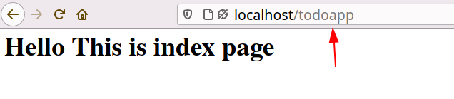

# Routing in LowCode

In **Lowcode Framework** routes are automated so you don't have to worry about routing. Lowcode automatically setup routes for your application.

Lowcode routes works in two ways:-

- **[Resource Routes]()**
- **[Custom Routes]()**

Generally we create Routes to **views** and **controllers** So Let's understand Routes for both one by one.

# Routes for Views

**Note:-** For better understanding learn how to create **views** in LowCode from [here]().

When a module is created in the framework a resource route is automatically configured for it.

Example if a module is named as **"Blog"**, then following routes are created

| Verb |  Path | Route Name | Override View |
|------|-------|------------|----------------|
| GET  | /**blog** | **blog**.index | custom/ext/view/**blog**/index.blade.php |
| GET  | /**blog**/{key} | **blog**.show | custom/ext/view/**blog**/show.blade.php |
| GET  | /**blog**/create | **blog**.create | custom/ext/view/**blog**/create.blade.php |
| POST | /**blog** | **blog**.store | custom/ext/view/**blog**/store.blade.php |
| GET  | /**blog**/{key}/edit | **blog**.edit | custom/ext/view/**blog**/edit.blade.php |
| POST | /**blog**/{key} | **blog**.update | custom/ext/view/**blog**/update.blade.php |
| POST | /**blog**/{key}/delete | **blog**.destroy | custom/ext/view/**blog**/destroy.blade.php |

**eg:-** Accessing index page 

## Custom Routes

Apart from resource routes we also need to create some views to show more functionality or pages in an application so for that lowcode also automated the routes you just need to undestand how you can use them.

Let's understand them.

- Suppose you have created a file named **about.blade.php** in your **views** folder then  url of this page will be **/blog?__view=about** Its just that simple. So to link **about page** just add this url and lowcode automatically sets the routes to this page.

	**eg:-** 

- It is also possible that you have to create a new directory in views folder to store files so for that pages url will be **/blog?__view=directoryname/file**. For eg:- Suppose I have created the **guest** folder in views then i created a file in it named as **"guestui.blade.php"** so to access it url will be **/blog?__guest/guestui** 

	**eg:-**

- You can also access resouce routes with custom routes in the same way you access pages other than Resource Routes.
	
	**eg:-** Resource Routes as Custom Routes

	

# Routes for Controller

**Updating**