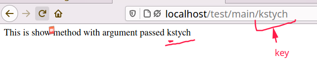

# Routing in LowCode

In **Lowcode Framework** Routing is very simple. All Routes to **Views** or **Controllers** are automated so you don't have to worry about routing. Lowcode automatically setup routes for your application. you just need to Understand the **URL Stucture** for accessing the **views** and **Controllers** related to **Module**.

Lowcode routes works in two ways:-

- **[Resource Routes](#resource-routes)**
- **[Custom Routes](#custom-routes)**

Let's undestand Both one by one:- 

---

## Resource Routes

This routes are general routes that almost every applications have and they are automatically configured for **views** and **Controllers** related to **Module**. by LowCode.

**List of Resource Route**

| Method | Description |
|--------|-------------|
| index  | Index Page Operation|
| show   | Show Data Operation |
| create | Create Data Operation  |
| store  | Store Data Operation  |
| edit   | Edit Data Operation |
| update | Update Data Operation |
| destroy| Delete Data Operation|

The above Listed Routes are basic routes created for your module **views** and **controllers**.

Now Let's understand the URL Stucture for both **Views** and **Controllers**.

### Resource Route Path for Views
When a module is created in the framework a resource route for its **views** are automatically configured for it.

For Example if a module is named as **"Test"**, then Route Path for all basic routes will be :- 

| Verb |  Path | Route Name | Override View |
|------|-------|------------|----------------|
| GET  | /**test** | **test**.index | custom/ext/view/**test**/index.blade.php |
| GET  | /**test**/{key} | **test**.show | custom/ext/view/**test**/show.blade.php |
| GET  | /**test**/create | **test**.create | custom/ext/view/**test**/create.blade.php |
| POST | /**test** | **test**.store | custom/ext/view/**test**/store.blade.php |
| GET  | /**test**/{key}/edit | **test**.edit | custom/ext/view/**test**/edit.blade.php |
| POST | /**test**/{key} | **test**.update | custom/ext/view/**test**/update.blade.php |
| POST | /**test**/{key}/delete | **test**.destroy | custom/ext/view/**test**/destroy.blade.php |

**Note** :- Here **{key}** is any attibute like Id,Title,anything for that you want to perform the desired operation. 

For Ex-1:- To access the index page URL, will be :- **/localhost/test**

Ex-2:- To access the show page, URL will be :- **localhost/{key}**

**Learn more about Views in Lowcode [here](Views.md).**

### Resource Route Path for Controllers
**Views** are used for simpler cases where you directly open the Pages But for processing some operation before loading the page We need **Controllers** passing requests through **Controller** classes is required in any non trivial application.Controllers are the entry point for all custom business logic.

For All the **Controllers** of a **Module** Resource route for methods in Controller class are also automatically configured. 

For Example if a Module name is **"Test"** and it have a Controller named **Main** then Route Path for Methods in **Main** Controller will be:-

| Verb |  Path | Route Name | Controller File @ Function |
|------|-------|------------|-----------------|
| GET  | /**test**/**main** | **test**.index | custom/ext/packages/**test**/Controller/**Main**.php @ index |
| GET  | /**test**/**main**/{key} | **test**.show | custom/ext/packages/**test**/Controller/**Main**.php @ show |
| GET  | /**test**/**main**/create | **test**.create | custom/ext/packages/**test**/Controller/**Main**.php @ create |
| POST | /**test**/**main** | **test**.store | custom/ext/packages/**test**/Controller/**Main**.php @ store |
| GET  | /**test**/**main**/{key}/edit | **test**.edit | custom/ext/packages/**test**/Controller/**Main**.php @ edit |
| POST (@method('put')) | /**test**/**main**/{key} | **test**.update | custom/ext/packages/**test**/Controller/**Main**.php @ update |
| POST (@method('delete'))| /**test**/**main**/{key} | **test**.destroy | custom/ext/packages/**test**/Controller/**Main**.php @ destroy |

**Note** :- Here **{key}** is any attibute like Id,Title,anything for that you want to perform the desired operation. 

For Ex-1:- To call the index method of Main Controller class, URL will be :- **/localhost/test/main**

Ex-2:- To call the show method of Main Controller class, URL will be :- **localhost/test/main/{key}**

**Learn more about Controller from [here]().**

---

## Custom Routes

Apart from resource routes we also need to create some views to show more functionality or pages in an application so for that lowcode also automated the routes you just need to undestand how you can use them.

Let's understand them.

- Suppose you have created a file named **about.blade.php** in your **views** folder and the name of module is **todoapp** then  url for this page will be **/todoapp?__view=about** Its just that simple. So to link **about page** just add this url and lowcode automatically sets the routes to this page.

	**eg:-** 

- It is also possible that you can create a new directory in views folder to store files so for that pages stored in another directory url will be **/tdodapp?__view=directoryname/file**. For eg:- Suppose I have created the **guest** folder in views then i created a file in it named as **"guestui.blade.php"** so to access it url will be **/todoapp?__guest/guestui** 

	**eg:-**

- You can also access resouce routes pages with custom routes in the same way you access pages other than Resource Routes.
	
	**eg:-** Resource Routes as Custom Routes

	

