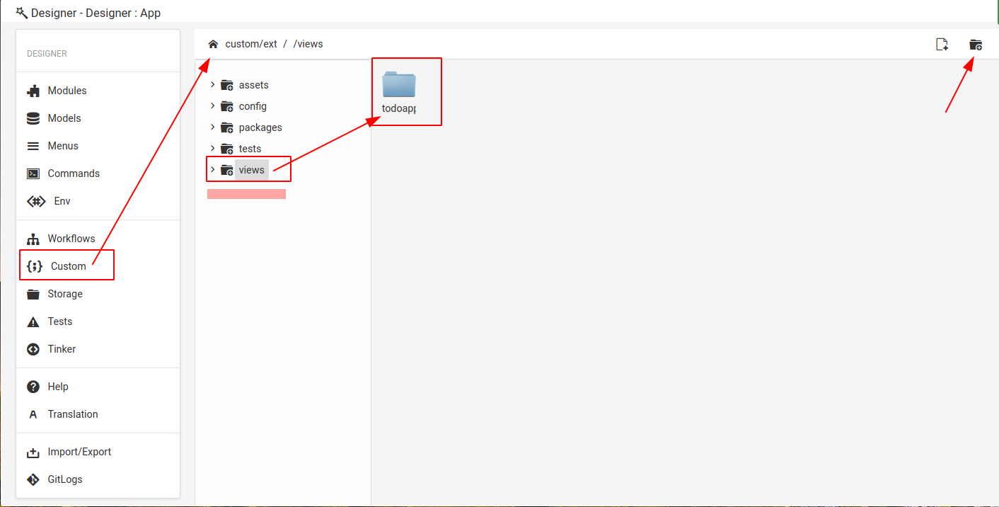
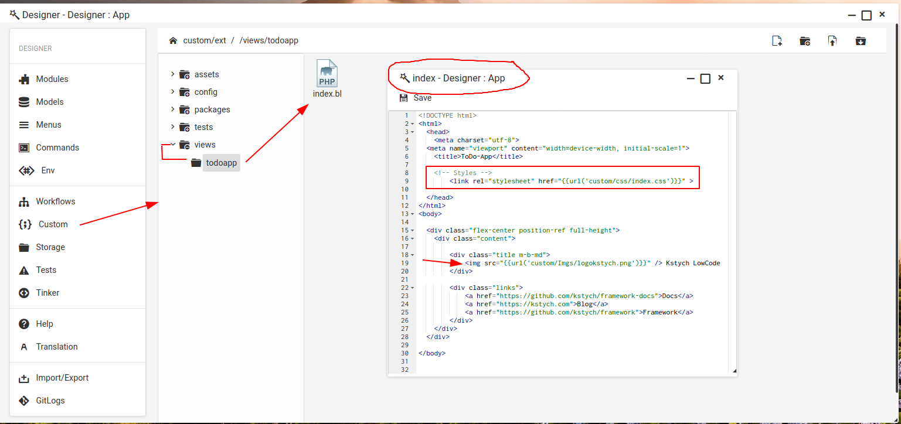
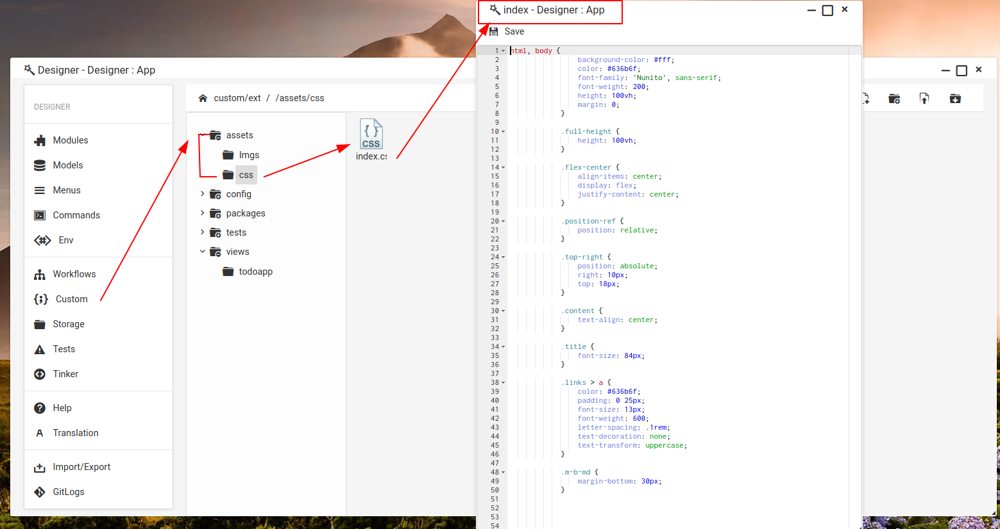
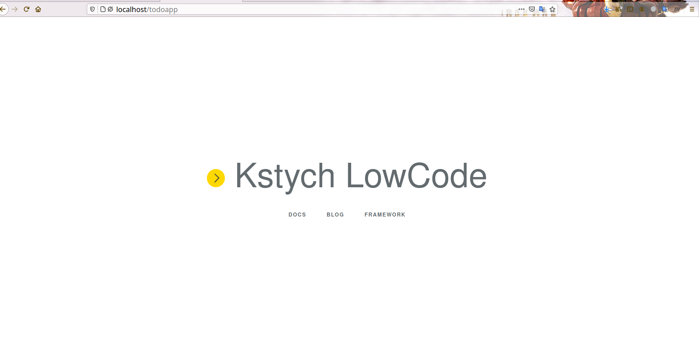

# Views in Lowcode

Views contain the **HTML served** by your application. Views are stored in the **custom/ext/views/ directory**. 

When we create a **Module** for our application so to serve its frontend we need to create a folder for view in **custom/ext/views/**

## Table Of Content

- [Setting up views Directory in Lowcode](#setting-up-views-directory-in-lowcode)
- [Creating View Files for Frontend](#creating-view-files-for-frontend)
- [Assets](#assets)
	- [Creating Assets for your Application](#creating-assets-for-your-application)
	- [Linking Assests files in views](#linking-assests-files-in-views)
- [Example](#example)

## Setting up views Directory in Lowcode

To create a views for a module follow below steps:-

- After creating **Module** from Module menu in Designer switch to **Custom** Menu in Designer.
- In **Custom** Menu Look for **Views** Folder click on it to open.
- Now create a Folder named same as **ModuleName** but in **Lowercase**.
- Now open that newly created folder and start creating **Html,Php,Blade.php** files to serve Frontend for application.
 

Let's understand it by viewing an example.Suppose your Module Name is **ToDoApp** then we will create Folder in Views Directory named as **"todoapp"** and Create a **index.blade.php** file in it.

Now we have setup our views directory where we will keep our all views related to that Module.

Let's Understand **creating files in views for Module Frontend**.

## Creating View Files for Frontend

**Lowcode**  provides you to build your application in Less time for that In Lowcode you don't have to worry about Routing It's all done for you automatically as soon as you create Module. you can Learn More about Routing [here]().

In order to get benefited by Lowcode use resource file to serve Frontend for your application but you are all free to create as many views for your application with any name. So you just need to learn how you can access them.

Lowcode allows you to create View files in two ways :-

- **Automated route Files**

	Automated view Files are **index,edit,create,show,store,update** these files are automatically routed to access this files url will be:-
| Verb |  Path | Route Name | Override View |
|------|-------|------------|----------------|
| GET  | /**todo** | **todo**.index | custom/ext/view/**todo**/index.blade.php |
| GET  | /**todo**/{key} | **todo**.show | custom/ext/view/**todo**/show.blade.php |
| GET  | /**todo**/create | **todo**.create | custom/ext/view/**todo**/create.blade.php |
| POST | /**todo** | **todo**.store | custom/ext/view/**todo**/store.blade.php |
| GET  | /**todo**/{key}/edit | **todo**.edit | custom/ext/view/**todo**/edit.blade.php |
| POST | /**todo**/{key} | **todo**.update | custom/ext/view/**todo**/update.blade.php |
| POST | /**todo**/{key}/delete | **todo**.destroy | custom/ext/view/**todo**/destroy.blade.php |

**Note:-** Here **todo** is the module name. 

- **Custom route Files**
	
	Lowcode freely allows you to choose file name for views if you don't want to use above files for module you can use custom file name for serving frontend.

	**For eg:-** suppose you want create a file named as "**support.blade.php**" so to access this file your url will be "**/modulename?__view=support**" this url will return the "**support.blade.php**" page in browser.

You can learn about routing from [Routing docs]().

## Assets

Assets are the used to keep your **Css,Js,Images** etc file that you may need to use in your view files to make your webpage look awesome.

### Creating Assets for your Application

**Steps to Follow:-**

- Click on **assets** Folder in **custom menu** from Designer.
- Then you can Eighter create a Folder in it or just create a file or upload a file.
- For eg- Suppose I want to include css file for my Views so I will create css folder and create a file in named as Main.css then start adding css code.
- Similary In the same manner you can create Folder or Files in your **assets** folder for Documents,Images,Js etc.

Now Once you have Created or Uploaded files in assets **Question** is how you can access this files so that you can include them in your views.

Let's check this

### Linking Assests files in views

To Link or open any file from assets id very easy Url for Every file is "**custom/PATH/filename.extension**".

For eg:- Suppose i have **Main.css** file in **css** Folder of assests then url will be  - "**custom/css/Main.css**" .

## Example

A simple **HomePage** for Application.

#### index.blade.php

#### index.css

#### Output

---
---
## Next Step

Learn How to use **Blade Template** in **Lowcode** from [here]() 

Learn about **Model,DB-Tables,Accessing Database** from view [here]()

	 

