# BlogPost - LowCode
A simple Blog Application in [LowCode Framework](https://kstych.com)

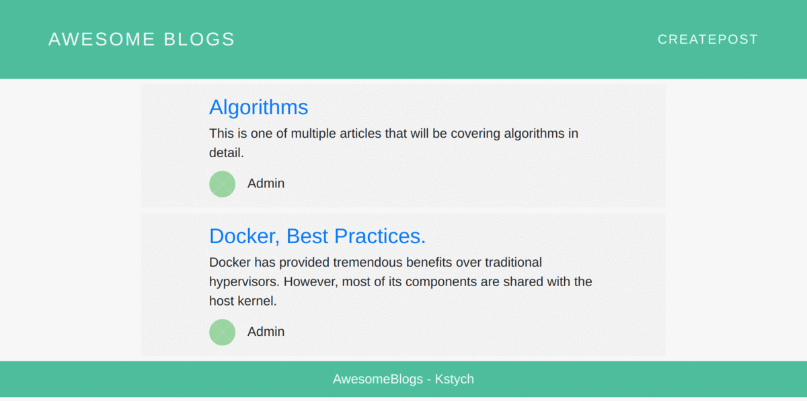


### Steps to create BlogPost App in LowCode Framework 
- [Start the Framework](#start-the-framework)
- [Creating BlogPost module and models for App](#creating-blogPost-module-in-framework)
- [Adding Columns in Model](#adding-column-in-model)
- [Creating controllers to manage requests](#creating-controller-for-app)
- [Creating different views for App](#creating-views-for-app)


##  Start the Framework
For making something in Lowcode we need to start the Framework First. So  We will create a new directory named BlogPost anywhere 
and clone the framework in newly created directory then run the script.

```
[Desktop]$ mkdir BlogPost
[BlogPost]$ git clone https://github.com/kstych/framework
[BlogPost]$ sudo su
[BlogPost]$ cd framework
[framework]$ ./kstych.sh
		  
```
Now Open your favorite Browser and open localhost and now Framework is started.

---

## Creating BlogPost Module in Framework
Now Go to Designer and open Module Section. Create the new module and add models as shown in below fig. You can Change the Module Name,Access User,Models
According to your choice.

**eg:-**

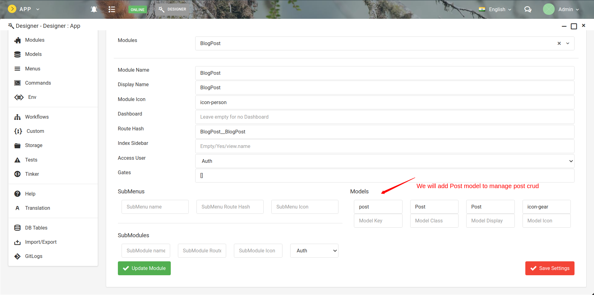

Now Hit the save Button and your module is created and models are generated . You can update or create models anytime.

Now we need to provide module access in role to access the module. For doing this click on right side **admin** dropdown open **Admin** menu and select **Role** open role and add module init. As shown in fig.

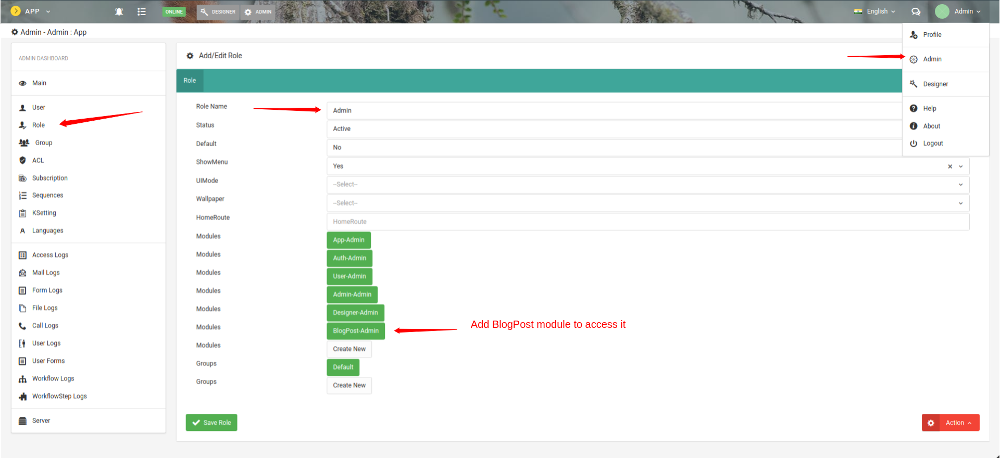

You can test that your module is created or not by searching browser for **localhost/BlogPost** [Here BlogPost is my module name you can enter your module name] and now what ever you create in your app use the same url to check output. 

Now Your application module and its model are created let's add column in Model.

## Adding Column in Model
For adding Column in Model switch to **Models Menu** in **Designer tab**.

- Now Select the Module and Model in which you want to add columns.
- You will see a form where you have to provide table name and its columns once you are done with table columns hit the **Save Model** Button.

**eg:-**

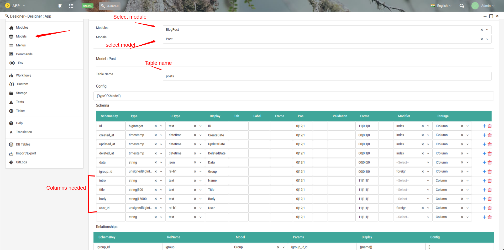
 
 - In this example I have created a **posts table** in **Post Model** of **BlogPost Module** .
 - In **posts table** I have added title,intro,body and user columns and keep the default schema same. You can add more columns according to your requirement.
 - **user** column is a relation rel-b1 column so we need to define relation for that see below image for that.
 
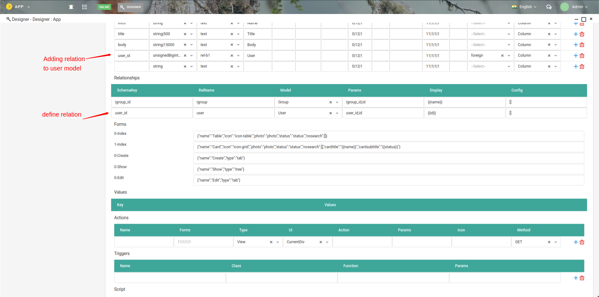


Now we are all set to design our app Look . Till now We have created our App Module and its Model and we also added columns in our Post Model. 

For moving forward we will create a **Controller** , **Assests** and **views** folder.

## Creating Controller for app
---
So For creating a controller goto **Custom** menu from **Designer App** look for **Packages** and create new directory named same as the **ModulName** in our case we will create **BlogPost** Directory. Add one more folder in that directory named **Controller**.

Create a new file in that Controller Directory as BlogPost.php .

**eg:- For Directory Sturcture**
<p align="center">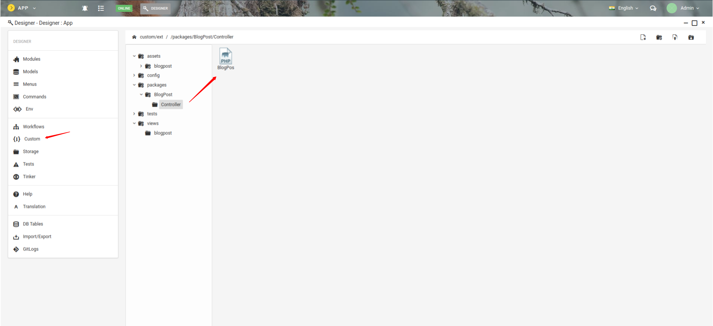</p>

- Now Add the below codes in BlogPost.php

```
<?php namespace App\Custom\BlogPost\Controller;

use DB;
use Auth;
use Request;
class BlogPost
{
    public function __construct(){}

    public function index()
    {
      $posts = kmodel('Post')::latest()->paginate(15);
      return view("custom.blogpost.index",['posts'=>$posts]);
    }
    public function show($id)
    {
      $post = kmodel('Post')::find($id);
      $latests = kmodel('Post')::latest()->where('id','!=',$id)->take(3)->get();

      return view("custom.blogpost.show",['post'=>$post,'latests'=>$latests]);
    }
    public function create()
    {
        $id = request('id');
        $post = kmodel('Post')::find($id);
        if(!$post) $post = kmodel('Post')::make();
        return view("custom.blogpost.create",['post'=>$post]);
    }
    public function store()
    {
      request()->validate([
    		'title'=>'required',
    		'intro'=>'required',
    		'body'=>'required',
    	]);

      $Post = kmodel('Post');

    	$post = new $Post();
    	$post->title=request('title');
    	$post->intro=request('intro');
    	$post->body=request('body');
    	$post->user_id=Auth::user()->id;
    	$post->save();

      return redirect('/blogpost');
    }
    public function edit($id)
    {

    }
    public function update($id)
    {
    	$Post = kmodel('Post')::find($id);
    	$Post->title = request('title');
    	$Post->intro = request('intro');
    	$Post->body  = request('body');
    	 $Post->save();

      return redirect('/blogpost/'.$id.'?'.request('title'));

    }

    public function destroy($id)
    {
      $obj = Kmodel('Post')::where('id',$id)->first();
      if($obj) $obj->delete();
   	  return redirect('/blogpost');

    }
}


```

- Here I have used basic resource controllers and customized with sql query to do the task of insert,delete and update data in **posts** Table
	- **index()**   method to show our homepage.
	- **show()**    method to show post.
	- **store()**   method to insert data in **posts** Table.
	- **update()**  method to update the data in **posts** Table.
	- **destroy()** method to delete the data from **posts** Table.

Now we have created our controller for performing tasks Let's back to views folder of adding functionality of **Create** , **Delete** , **Edit** Posts

## Creating Assets for App

Assets folder is used to store images,css,js files.
 - For Creating Assets folder goto **Custom** Menu of Designer and then open assets folder there create a new folder named blogpost and add your files init.
 - Url of any file will be "custom/blogpost/filename" . 

	For eg:-  if you have have place **abc.css** files in **blogpost/css** folder in **assets** then url will be **"custom/blogpost/css/abc.css"**

**eg:-**

<p align="center">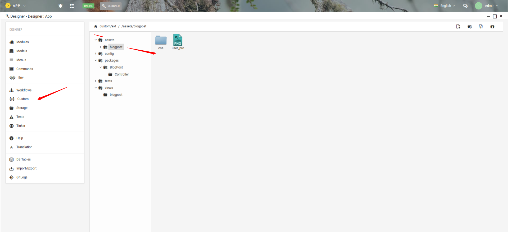</p>
	
## Creating Views for App

- For creating Views Go to **Custom** Menu of Designer and then move to views folder.
- In Views Folder create a new folder as same as the  name of your module but in small letters. For eg: If Module name is **'BlogPost'** create Folder with name **'blogpost'**.

**eg:-**

<p align="center">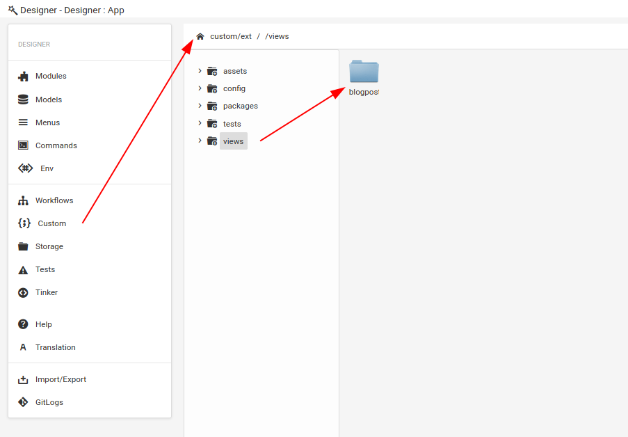</p>
<p align="center">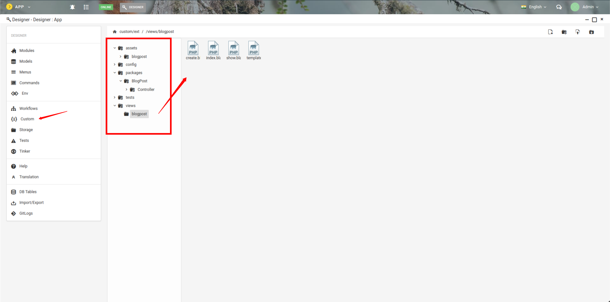</p>
So now we are ready to create our views :- 

First of all Let's create a template for our app so that we need to write less.
- Create a new file named **template.blade.php** (you can choose any name that you are comfortable with its not an issue).
- Open **template.blade.php** and design your template for now you can copy from here or you can use your own just see how to do that.
- Save the file using **ctrl+s** or click the save button.

```
 <!DOCTYPE html>
<html lang="en">
  <head>
    <meta charset="utf-8">
    <meta http-equiv="X-UA-Compatible" content="IE=edge">
    <meta name="viewport" content="width=device-width, initial-scale=1">
    <title>AwesomeBlogs</title>

    <!-- Here we will link css file-->
    <link rel="stylesheet" href="{{ url('custom/blogpost/css/main.css') }}">
    <link rel="stylesheet" href="https://stackpath.bootstrapcdn.com/bootstrap/4.3.1/css/bootstrap.min.css" integrity="sha384-ggOyR0iXCbMQv3Xipma34MD+dH/1fQ784/j6cY/iJTQUOhcWr7x9JvoRxT2MZw1T" crossorigin="anonymous">

	  <style>
	   body{font-size:25px;}
	   h3{font-size:40px;}
	  </style>
  </head>
  <body>
      <div id="header">
      <div class="container" style="max-width:90%">
        <a href="/blogpost" style="font-size:35px;padding:0px;float:left;">Awesome Blogs</a>
        <ul id="header-nav">
         <li><a href="/blogpost/create">CreatePost</a></li>         
        </ul>
      </div>
    </div>

    @yield('content')

<!-- Footer -->
<footer class="page-footer font-small" style="background-color:#1ABC9C;">

  <!-- Copyright -->
  <div class="text-center py-3">
    <a href="/localhost/blogpost" style="color:white"> AwesomeBlogs - Kstych</a>
  </div>
  <!-- Copyright -->

</footer>
<!-- Footer -->


</body>
</html>


```
   

Now Template for application is ready let's create an index,create and show file to show our posts.	

- Create a new file named **index.blade.php** [Here you should use the same file name to get benefited by lowcode defaults routes otherwise you need to use custom route as **locahost/blogpost?\_\_view=filename**  to access page]. Learn about Default Routes [here]()
- Write below lines in index.blade.php

```
@extends('custom.blogpost.template')

@section('content')
     <div id="content" style="max-width:1000px;margin:10px auto">

      @forelse($posts as $post)

        <div class="post-container">
        <div class="post" style="padding:20px 30px;">
          <h3 class="post-title"><a href="/blogpost/{{$post->id}}?{{$post->title}}">{{$post->title}}</a></h3>
          <div class="post-content">
            <p>{{$post->intro}}</p>
          </div>
          <div class="post-author">
            user->getFileLink('photo')}}" alt="user profile pic">
            <span>{{$post->user->fullname??''}}</span>

          </div>
        </div>
      </div>

        @empty
          <div class="post-container">
            <div class="post" style="text-align: center;">
              Nothing here yet
            </div>
          </div>
      @endforelse


    </div>
@endsection


```
- Now if you search your browser for **localhost/BlogPost** you will get the output like below 

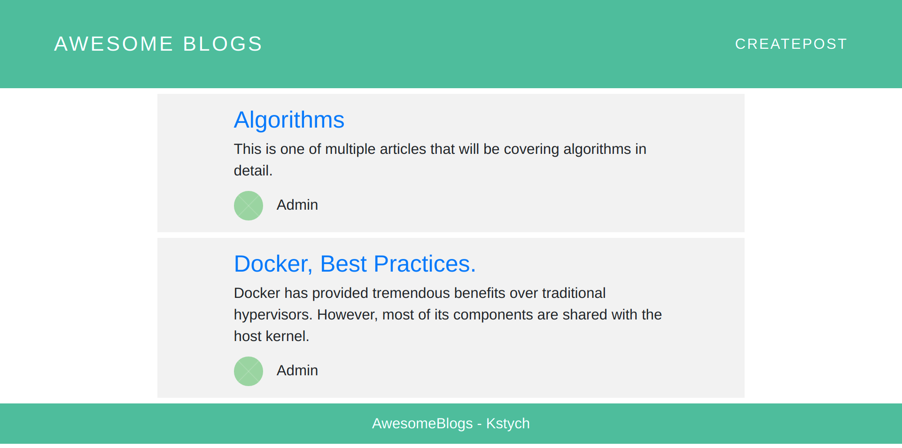

- Now we have generated our index page for our app Lets add create post view.

**Create  Post functionality**

- Create a new file named **create.blade.php** in **views/blogpost** folder
- Design the form to create a post in Blog. Copy Codes from below
- Url for Create file will be :- **localhost/blogpost/create** 
- Same UI we will use to edit the post with just a minor change we will use put method to send form data with post id.

```
@extends('custom.blogpost.template')

@section('content')

	<div class="container" style="margin-bottom:20px;">
		<br/>
			<h3>Create New Post</h3>
		<br/>
		<form @if($post->id) action="/blogpost/{{$post->id}}" @else  action="/blogpost" @endif method="POST"  >
			@csrf
     @if($post->id) <input name="_method" type="hidden" value="put">@endif
		  <div class="form-group">
		    <label>Title</label>
		    <input type="text" class="form-control"  value="{{$post->title}}"  name="title" placeholder="Enter title" required>

		  </div>
		  <div class="form-group">
		    <label>Intro</label>
		    <textarea type="textarea" class="form-control" name="intro"   placeholder="Enter Intro" required>{{$post->intro}}</textarea>
		  </div>


		  <div class="form-group">
		    <label>Body</label>
		    <textarea type="textarea" class="form-control" name="body"    placeholder="Enter body" required>{{$post->body}}</textarea>
		  </div>

		  <center>
		     <button type="submit" class="btn btn-primary" >Submit</button>
		  </center>
		</form>
	</div>
@endsection


```
**Output:-**

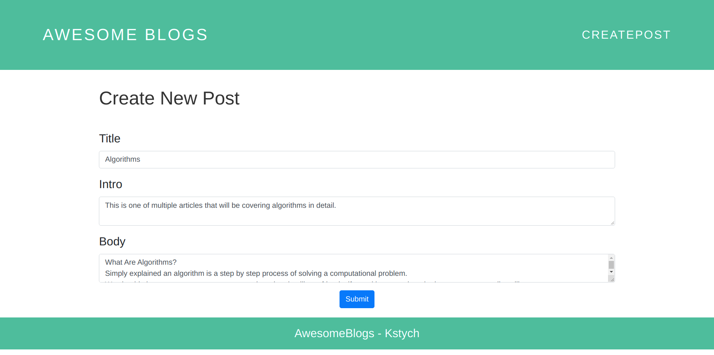


Now our main index ans create post page is ready Let's create a single post page where user should go for reading full post.

- Create a new file as **show.blade.php**.
- Desing your post page by writing below codes.

```
@extends('custom.blogpost.template')

@section('content')

<div id="content" style="max-width:80%;margin:10px auto;">
	  <div class="post-container container " style="padding-bottom:10px;">
	    <div class="post" style="padding:20px;">
	      <h3 class="post-title"><a href="/blogpost/{{$post->id}}?{{$post->title}}">{{$post->title}}</a></h3>
	      <div class="post-content">
	        <p>{{$post->body}}</p>
	      </div>
	      <div class="post-author">
	        user->getFileLink('photo')}}" alt="user profile pic">
	        <span>{{$post->user->fullname}}</span>
	      </div>
	    </div>
	    <div class="container">
		    <div class="row">
	    	   <div class="col-sm-6" style="text-align:right">
	        	  <form method="Post" action="/blogpost/{{$post->id}}" >
	        	    @csrf
	        	    <input name="_method" type="hidden" value="DELETE">
	                <button  type="submit" class="btn btn-danger" value="delete">Delete</button></a>
	        	  </form>
		       </div>
		       <div class="col-sm-6">
			       <a href="/blogpost/create?id={{$post->id}}"><button  class="btn btn-primary">Edit</button></a>
	       	   </div>
			</div>
		</div>
	   </div>
</div>

<div style="margin:50px auto; width:50%">

	<h2 align="center">Latest Post</h2>
	 @forelse($latests as $latest)
        <div class="post-container">
        <div class="post" style="padding:20px 35px;">
          <h3 class="post-title"><a href="/blogpost/{{$latest->id}}?{{$latest->title}}">{{$latest->title}}</a></h3>
          <div class="post-content">
            <p>{{$latest->intro}}</p>
          </div>
          <div class="post-author">
            user->getFileLink('photo')}}" alt="user profile pic">
            <span>{{$latest->user->fullname}}</span>
          </div>
        </div>
        </div>

      @empty
	      <div class="post-container">
	        <div class="post" style="text-align: center;">
	          Nothing here yet
	        </div>
	      </div>
      @endforelse


</div>

@endsection


```

- Click the save button and Let's check how it looks search for url **localhost/BlogPost/{post_id}** or just simply click on post from index page.

**Output:-**

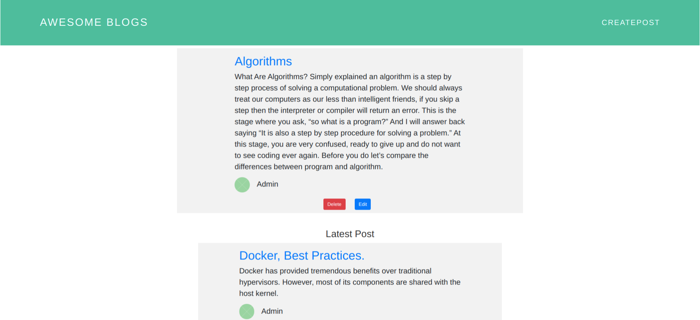


**Delete Post functionality**

- For Deleting post you don't need to create a page but if you want to create so you can create that page. For deleting any post you need create a small Form that will send the **delete request to controller** then controller will execute **destroy()** method from controller and you post will be deleted.
- Form Eg:- 

```
<form method="Post" action="/blogpost/{{$post->id}}" >
@csrf
    <input name="_method" type="hidden" value="DELETE">
    <button  type="submit" class="btn btn-danger" value="delete">Delete</button></a>
</form>

```
- Basic things to understand is that you need provide action url as /blogpost/{{$post->id}}. 
- And you need to include " <input name="_method" type="hidden" value="DELETE">" in your form. 
- Now whenever you **submit** the post it will call the **destroy()** from  controller.

